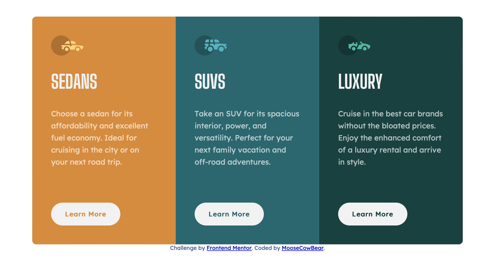
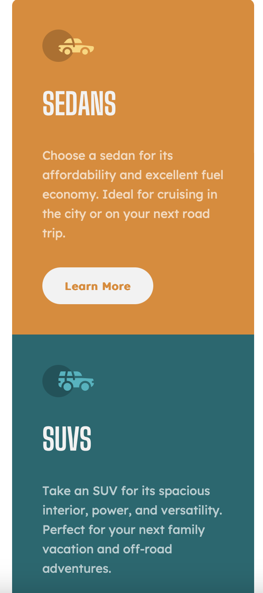

# Frontend Mentor - 3-column preview card component solution

This is a solution to the [3-column preview card component challenge on Frontend Mentor](https://www.frontendmentor.io/challenges/3column-preview-card-component-pH92eAR2-).

### The challenge

Users should be able to:

- View the optimal layout depending on their device's screen size
- See hover states for interactive elements

### Screenshots

### Links

- [Solution]()
- [Live]()

### Built with

- CSS custom properties
- Flexbox
- Grid

### Useful resources

[A Modern CSS Reset](https://andy-bell.co.uk/a-modern-css-reset/) - Trying to do resets better. As suggested by @KeganF on Frontend Mentor
[This Stack Overflow](https://stackoverflow.com/questions/36004926/equal-height-rows-in-a-flex-container) - For showing me my first instincts were bad.

### Author

- GitHub - [MooseCowBear](https://github.com/MooseCowBear)
- Frontend Mentor - [@MooseCowBear](https://www.frontendmentor.io/profile/MooseCowBear)

